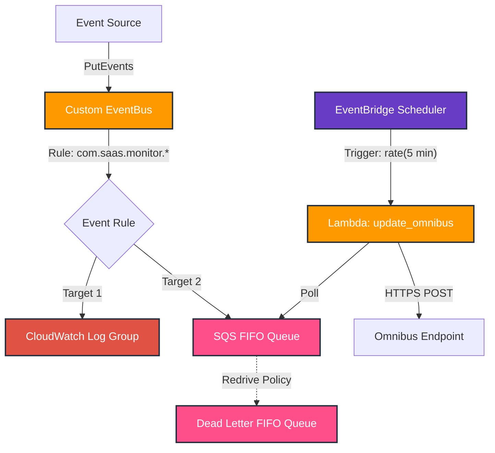

# SaaS Monitor EventBus


A modular Terraform project for deploying a robust EventBridge monitoring architecture on AWS. This project sets up a custom EventBus, routing rules, and multiple targets including CloudWatch Logs and SQS with Dead Letter Queues (DLQ). It also processes events using a Lambda function triggered by an EventBridge Scheduler (Polling pattern).

## Architecture



## Features

- **Modular Design**: Each component (Bus, Queue, Logs, Rules, Lambda, Scheduler) is a standalone Terraform module.
- **Resilience**: FIFO SQS queues with `content_based_deduplication` and configured Dead Letter Queues (DLQ).
- **Observability**: All events are logged to CloudWatch Logs.
- **Event Replay**: EventBridge Archive enabled (30-day retention).
- **Processing**: Python Lambda function (`update_omnibus`) processes messages using a Polling pattern triggered by EventBridge Scheduler.
- **Security**: IAM roles are scoped with least-privilege permissions.

## Modules

| Module | Description | Source |
|--------|-------------|--------|
| `eventbridge-bus` | Creates the custom EventBridge bus with Archive | `./modules/eventbridge-bus` |
| `eventbridge-rule` | Manages rules and targets | `./modules/eventbridge-rule` |
| `sqs-queue` | Deploys SQS FIFO queues with DLQ | `./modules/sqs-queue` |
| `cloudwatch-log-group` | Sets up Log Groups with retention | `./modules/cloudwatch-log-group` |
| `lambda` | Deploys Lambda function with Layers and IAM | `./modules/lambda` |
| `eventbridge-scheduler` | Manages scheduled triggers | `./modules/eventbridge-scheduler` |

## Usage

To use this project, simply include the root module in your Terraform configuration:

```hcl
module "saas_monitor" {
  source = "./"

  aws_region = "eu-central-1"
  tags = {
    Project     = "SaaS-Monitor"
    Environment = "Production"
  }
}
```

### Inputs

| Name | Description | Type | Default |
|------|-------------|------|---------|
| `aws_region` | The AWS region to deploy resources into | `string` | `eu-central-1` |
| `tags` | Common tags to apply to all resources | `map(string)` | `{...}` |

### Outputs

| Name | Description |
|------|-------------|
| `sqs_queue_url` | The URL of the main SQS queue |
| `sqs_dlq_url` | The URL of the Dead Letter Queue |
| `lambda_function_name` | The name of the update_omnibus Lambda |
| `scheduler_arn` | The ARN of the EventBridge Schedule |

## Requirements

- Terraform >= 1.5
- AWS Provider >= 5.0

## License

MIT
